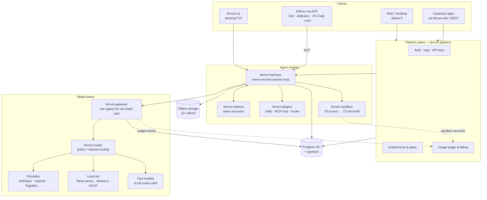

# 01 — Architecture

One page, four diagrams, and the ten sentences that matter. Every box has its
own spec in `docs/1x-*.md`.

## The system



## The ten sentences

1. **Everything a session does is an event** in an append-only log; state is a
   fold over the log, so resume, replay, branch, audit, and training-data
   mining are all the same primitive (`03-protocol.md`).
2. **The harness is a state machine, not a framework** — assemble context,
   stream the model, gate tool calls through permissions, execute in the
   sandbox, fold reduced observations back in, repeat until final or budget
   stop (`13-harness.md`).
3. **Every model call in the company goes through ferrum-gateway** — cost
   attribution, quota enforcement, caching, failover, and audit exist because
   this is the only door (`11-gateway.md`).
4. **The router is policy first, learning second** — YAML rules route by task
   class/cost/latency/privacy on day one; eval scorecards and a trained
   classifier refine it later (`12-router.md`).
5. **Tool output never enters context raw** — the reducer compresses,
   elides, spills large artifacts to storage with handles, and accounts for
   savings against prompt-cache pricing (`15-reducer.md`).
6. **Execution is tiered by trust**: pure in-process tools → WASM components →
   namespaced processes (bubblewrap-class) → Firecracker microVMs for cloud
   multi-tenant (`14-sandbox.md`).
7. **We speak the open protocols at every boundary** — MCP in (tools), ACP up
   (editors), OpenAI-compatible down (model backends), SKILL.md sideways
   (skills) (`16-plugins.md`).
8. **Subscriptions and the API are one metering pipeline** — gateway and
   sandbox emit usage events into an internal ledger that is the source of
   truth; Stripe is a projection of it (`17-platform.md`).
9. **Offline is the same binary with a different config** — `ferrum local`
   bundles harness + gateway-lite + a GGUF server; capability degradation is
   explicit and announced to the prompt (`18-local.md`).
10. **Models are trained in Python, served in Rust, judged by evals** — LoRA on
    rented GPUs, exported to GGUF, gated in CI, deployed behind the same
    gateway interface as everything else (`19-training.md`).

## A request, end to end

User types "fix the failing test" in the CLI:

```
CLI ── user.message ──▶ HARNESS (session actor)
HARNESS: append event · assemble context (cache-aligned layout)
HARNESS ── ChatRequest ──▶ GATEWAY ── route(task=code, ctx=32k) ──▶ Anthropic
GATEWAY: check entitlement + budget · try cache · meter · stream back
HARNESS ◀─ assistant deltas ─ stream to CLI as events
MODEL asks: run_tests()
HARNESS: permission check (allowed by profile) → SANDBOX T2 exec
SANDBOX ── raw output (40 KB) ──▶ REDUCER ── 1.8 KB failure digest ──▶ context
HARNESS loops → model streams the fix → tool: edit_file (permission: ask)
CLI shows perm.request event → user approves → apply → run_tests → green
HARNESS: run.finished · ledger gets tokens + sandbox-seconds · log is complete
```

Every arrow above is an event with a `session_id`/`turn_id`/`seq`, one trace
spans the whole path, and the ledger row reconciles with the provider invoice.

## Deployment shapes

Same crates, three compositions:

| Shape | Composition | Who |
|---|---|---|
| **Dev / solo** | `ferrum local` — everything in one process, SQLite-or-PG, local GGUF | you, day 1 |
| **SaaS** | platform + harnessd + gateway as separate services; PG + object storage; microVM sandbox pool | phase 3 |
| **On-prem** | the SaaS shape, minus egress, in the customer's cluster; signed entitlement tokens | enterprise |

## What is deliberately NOT here

No Kubernetes operator, no service mesh, no Kafka, no ClickHouse, no second
database — until a measured limit forces each one. Postgres does queues
(`SKIP LOCKED`), vectors (pgvector 0.8.x, VectorChord when it outgrows RAM),
and OLTP. The upgrade paths are written down in `22-deployment.md` so adding
them later is a decision, not a rewrite.
